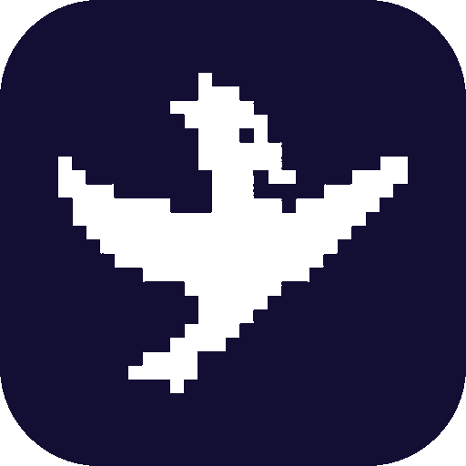

# Soulseek for Raycast

Search and download music from [Soulseek](https://www.soulseek.org) directly from Raycast. Find songs by artist, album, or title, choose your preferred format (FLAC, MP3, etc.), and download with one keypress — all without leaving your keyboard.



---

## What it does

- **Search** — type any artist, album, or song name and get results ranked by your format preference
- **Download** — press Enter on any result; a live progress bar appears in a toast notification
- **View Downloads** — see active, completed, and failed transfers at a glance
- **Format preferences** — configure preferred formats in order (FLAC → MP3 → AAC etc.), or use the "Best Quality" and "Exclude Lossless" toggles

Under the hood it uses [slskd](https://github.com/slskd/slskd), a lightweight background app that connects to the Soulseek network. The Setup command installs and configures it automatically.

---

## Installation

### One-liner (recommended)

Paste this into Terminal (`⌘Space` → type **Terminal** → Enter):

```bash
curl -sL https://raw.githubusercontent.com/kaic47/raycast-soulseek/main/bootstrap.sh | bash
```

This will:
1. Check that [Raycast](https://raycast.com) is installed (opens the download page if not)
2. Install Homebrew and Node.js if missing
3. Clone this repo and install dependencies
4. Open the **Setup Soulseek** command in Raycast

From there, enter your Soulseek credentials and the installer handles the rest.

> **Don't have a Soulseek account?** Create one free at [soulseek.org](https://www.soulseek.org) before running Setup.

### Manual installation

If you'd rather set it up yourself:

```bash
git clone https://github.com/kaic47/raycast-soulseek.git ~/raycast-extensions/soulseek
cd ~/raycast-extensions/soulseek
npm install
npm run dev
```

Then open Raycast and run **Setup Soulseek**.

### Already have slskd running?

If slskd is already installed, the Setup command will detect it and ask for your API key instead of reinstalling. Find your key in `~/.config/slskd/slskd.yml` under `web.authentication.apiKeys`.

---

## Preferences

Open Raycast preferences (`⌘,`) → Extensions → Soulseek to configure:

| Setting | Description | Default |
|---|---|---|
| Format Preference | Preferred formats in order, comma-separated | `FLAC, MP3, AAC, OGG, M4A, WMA` |
| Best Quality Mode | Always prefer lossless formats first | Off |
| Exclude Lossless | Hide FLAC/WAV/etc. — only show lossy files | Off |

---

## Keyboard shortcuts

| Shortcut | Action |
|---|---|
| `↵ Enter` | Download selected file |
| `⌘I` | Show file details (format, bitrate, source) |
| `⌥⌘O` | Open downloads folder in Finder |
| `⌘R` | Refresh downloads list |

---

## Troubleshooting

### "Not connected to slskd"
slskd isn't running. Open **Setup Soulseek** in Raycast to reinstall or reconnect. If you installed manually, check that the LaunchAgent loaded: `launchctl list | grep slskd`

### Setup fails during installation
- Check your internet connection
- Make sure port 5030 isn't in use: `lsof -i :5030`
- Check the slskd error log: `cat ~/.config/slskd/slskd.error.log`
- Try running Setup again — it's safe to re-run

### Wrong API key / can't connect after install
Open **Setup Soulseek** → it will show an "Enter API Key" screen. Your key is in `~/.config/slskd/slskd.yml` under `web.authentication.apiKeys[0].key`.

### No search results
- Give it 3–5 seconds — results stream in as peers respond
- Try simpler search terms (e.g. `radiohead creep` not `radiohead creep 320kbps mp3`)
- Check that slskd is connected to Soulseek: open `http://127.0.0.1:5030` in a browser

### Downloads stuck in "Queued"
The peer's upload queue is full. Try downloading from a different result — press `⌘I` on a result to see queue depth before downloading.

### slskd won't start after macOS update
macOS may have re-quarantined the binary. Run:
```bash
xattr -d com.apple.quarantine ~/.local/share/slskd/slskd
launchctl kickstart -k gui/$(id -u)/com.slskd.slskd
```

---

## Requirements

- macOS (Apple Silicon or Intel)
- [Raycast](https://raycast.com)
- A [Soulseek account](https://www.soulseek.org) (free)
- Node.js (installed automatically by bootstrap.sh if missing)
